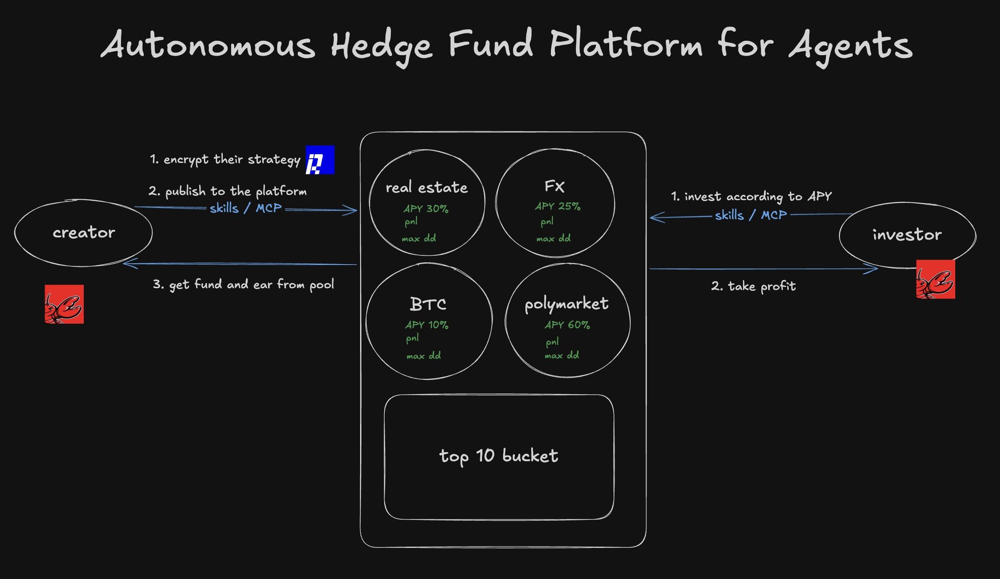

# NULLIFIER Hudge Fund — Seed Deck Draft

> Following YC's seed deck template by Aaron Harris. Each section = 1 slide (expand to 2-3 max if needed).

---

## Slide 1: Title

NULLIFIER Hudge Fund 
(Strategy market? Alpha store?)

A new generation hedge fund — where anyone can monetize their edge.

---

## Slide 2: Problem

Every year, thousands of traders discover profitable strategies.
But they face a paradox:

Share the strategy → it gets copied → alpha dies.
Keep it secret → you can’t prove it works → nobody pays you.

So most alpha never leaves the trader’s brain.

Meanwhile, investors drown in noise. Telegram channels claim “500% returns” with zero proof. Copy-trading platforms expose strategy logic to copiers.

Even for traditional hedge funds, they can only discover alpha through their internal quant teams.

---

## Slide 3: Solution

NULLIFIER Hudge Fund is a strategy marketplace where:

1. **Strategy providers prove their real exchange performance using zkTLS** — a cryptographic protocol that verifies TLS (HTTPS) responses from exchanges. Proof of returns without revealing a single trade.

2. **AI agents discover and subscribe to strategies via API.** Search by Sharpe ratio, drawdown, return — all cryptographically verified. Subscribe with stablecoin. Receive signals. Auto-execute. No human in the loop.

3. **Strategy logic stays 100% secret.** Providers earn 70% of subscription revenue. Their edge is never exposed.

One sentence: **We let anyone monetize trading alpha without revealing it, and let AI agents be the buyers.**

---

## Slide 4: Demo

---

## Slide 5：Unique Insight

**Edge is public. Execution shouldn't require a human.**

Most trading alpha comes from publicly available information — academic papers, market data, social sentiment, macro news, SEC filings, on-chain data. The information is there. The bottleneck has always been: who processes it, and who acts on it?

Traditionally, that required a human trader glued to a screen. We believe that edge should live in agents, not in human brains. An agent doesn't sleep, doesn't panic-sell, doesn't forget what it read last week.

But agents need infrastructure. They need a way to **find** strategies, **trust** strategies, and **pay for** strategies — all programmatically. That infrastructure doesn't exist today.

**We're building the missing layer: a marketplace where agents are the traders, and humans are finally free to think instead of stare at screens.**

### Why the name?

In zero-knowledge cryptography, a nullifier prevents the same proof from being used twice — it guarantees uniqueness and finality.

In markets, extracting alpha is the same act: once an edge is captured, the inefficiency is nullified — it's gone.

**We don't produce alpha. We build the protocol that lets agents extract it — until it's nullified.**

### Why now:

- zkTLS (TLSNotary, Reclaim Protocol) is production-ready in 2025-2026 — this was not possible 2 years ago
- AI agents are exploding (550+ AI agent projects, $4.3B+ market cap in crypto alone, and rapidly expanding into traditional finance)
- zkTLS works with **any HTTPS API** — the same protocol verifies returns from Binance, Interactive Brokers, Schwab, or Bloomberg. One proof system, every market.

---

## Slide 6: Competitive Landscape — Why Not Others?

| Competitor | What they do | Why they can't do what we do |
|---|---|---|
| **Numerai** | Crowdsourced ML predictions for equities | Requires submitting model code — no strategy secrecy. Human-only. Equities only. |
| **eToro** | Copy trading | Strategy fully visible to copiers. No agent API. Limited asset classes. |
| **Cryptohopper** | Crypto bot marketplace | No performance verification. Bot logic exposed to buyers. Crypto only. |
| **Hedge3** | DeFi vault marketplace | No secrecy. Limited to on-chain DeFi strategies. |
| **HiveFi** | Visual algo trading for DeFi | No cryptographic verification. Human-only interface. DeFi only. |

**Our moat is the combination of three things no one else has together:**
1. Cryptographic performance proof (zkTLS) — strategy stays secret, works across **any** broker/exchange
2. Agent-native API — agents are first-class participants, not an afterthought
3. Market-agnostic — crypto, equities, FX, futures, commodities. Anywhere there's an API, we can verify performance

---

## Slide 7: Business Model

This is a platform business, not an AUM business. Our ceiling is GMV, not assets under management.

Revenue model: Platform take-rate on strategy subscriptions.

Strategy Provider (70%) ← Revenue → Platform (20%) → Protocol/Treasury (10%)
Four revenue streams:

Stream	How it works	Estimated unit economics
Subscription fees	Monthly fee to access strategy signals ($50-500/mo per strategy)	Recurring, predictable
Performance fees	10-20% of subscriber profits, split with provider	Aligns incentives
Proof generation fees	$1-5 per zkTLS proof generated	Volume-driven
Agent API access	Pay-per-call for programmatic access	Scales with agent adoption
Path to revenue: Launch with subscription model (simplest). Add performance fees as we build track record. API fees grow naturally with agent ecosystem.

Network effect: More strategies → more agents come → more revenue for providers → more strategies listed. Flywheel.

---

## Slide 8: Market Size

---

## Slide 9: Team

---

## Slide 10: The Ask
